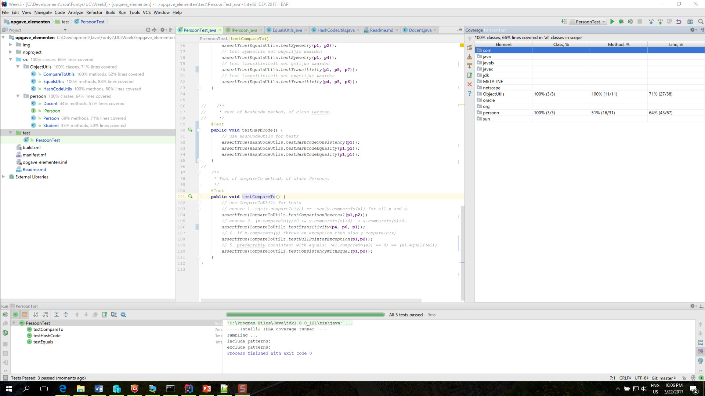
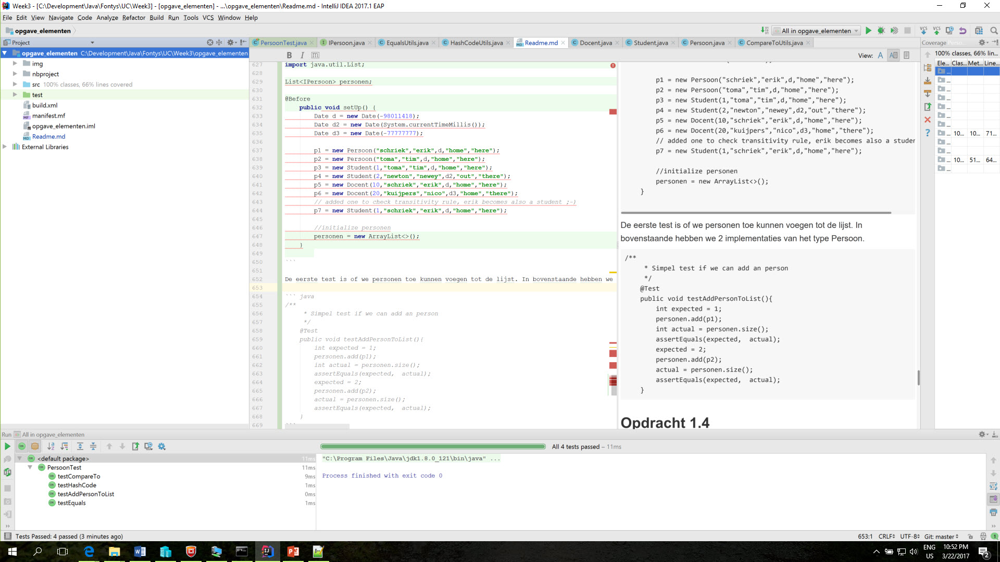
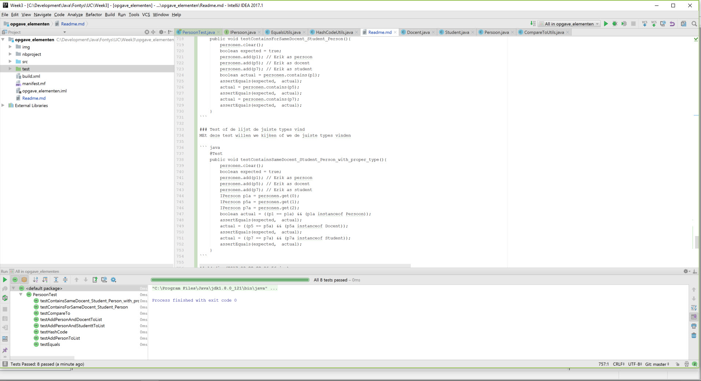
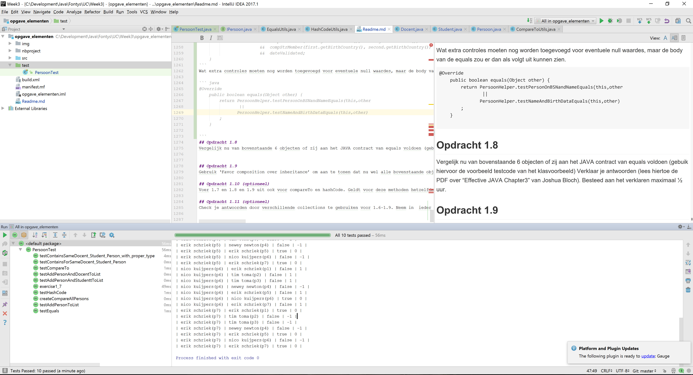

# Opdracht Week 3 Objecten
## Doel: Gebruiken standaard implementaties bij Objecten in Collections

## Inleiding.
Objecten (Elementen),  worden in collecties opgeslagen als Elementen. Deze elementen weten zelf niet in wat voor Collectie zij zich bevinden. Ook de ontwikkelaar weet niet in welke collecties de elementen in de toekomst gebruikt zullen gaan worden. Om dit op te lossen, dienen Objecten die in Collections gebruikt worden, toekomstig bestendig geimplementeerd te worden. Lees als voorbereiding de PDF over “Effective JAVA Chapter3” van Joshua Bloch. 

Voorbereiding
Gegeven is de Persoon klasse in bijgeleverd netbeans project. Deze persoon objecten bevatten een aantal attributen, die apart of gezamenlijk een uniek persoon kunnen identificeren. Zie gegeven netbeans project ‘ opgave_elementen’.
 
## Opdracht 1.1 
Maak unittesten die de equals eigenschappen van Persoon objecten testen:
Override hiertoe de equals methode om aan te tonen of 2 persoon objecten gelijk zijn, volgens volgende specificatie:
2 personen zijn gelijk indien:
-hun bsn en hun firstname and familyname hetzelfde zijn.
-hun firstname, familyname, birthdate, birthplace and birthcountry hetzelfde zijn.

### Unit testen

#### Equals testen
De equals testen waren al gegeven. 
``` java

    @Before
    public void setUp() {
        Date d = new Date(-98011418);
        Date d2 = new Date(System.currentTimeMillis());
        Date d3 = new Date(-77777777);

        p1 = new Persoon("schriek","erik",d,"home","here");
        p2 = new Persoon("toma","tim",d,"home","here");
        p3 = new Student(1,"toma","tim",d,"home","here");
        p4 = new Student(2,"newton","newey",d2,"out","there");
        p5 = new Docent(10,"schriek","erik",d,"home","here");
        p6 = new Docent(20,"kuijpers","nico",d3,"home","there");
        // added one to check transitivity rule, erik becomes also a student ;-)
        p7 = new Student(1,"schriek","erik",d,"home","here");
        
    }
            
    /**
     * Test of equals method, of class Persoon.
     */
    @Test
    public void testEquals() {
        // test null waarde
        assertTrue(EqualsUtils.testNullIsFalse(p1));
        // test reflexiviteit 
        assertTrue(EqualsUtils.testReflexitivity(p1));
        // test symmetrie met gelijke waarden
        assertTrue(EqualsUtils.testSymmetry(p1, p2));
        // test symmetrie met ongelijke waarden
        assertTrue(EqualsUtils.testSymmetry(p1, p4));
        // test transitiviteit met gelijke waarden
        assertTrue(EqualsUtils.testTransitivity(p1, p5, p7));
        // test transitiviteit met ongelijke waarden
        assertTrue(EqualsUtils.testTransitivity(p4, p5, p6));
    }

```
#### hashCode testen
Voor de hashcode volgen we de twee eisen voor de hashCode
- consistentie
- als equals gelijk is moet ook de hashcode gelijk zijn (codeEquality)

``` java
@Test
    public void testHashCode() {
        // use HashCodeUtils for tests
        assertTrue(HashCodeUtils.testHashCodeConsistency(p1));
        assertTrue(HashCodeUtils.testHashCodeEquality(p1,p1));
        assertTrue(HashCodeUtils.testHashCodeEquality(p1,p5));
    }
```

#### compareTo testen

Voor compareTo volgen we de regels van slide 3

```java
@Test
    public void testCompareTo() {
        // use CompareToUtils for tests
        // ensure 1. sgn(x.compareTo(y)) == -sgn(y.compareTo(x)) for all x and y.
        assertTrue(CompareToUtils.testComparisonReversal(p1,p2));
        // ensure 2. (x.compareTo(y)>0 && y.compareTo(z)>0) -> x.compareTo(z)>0.
        assertTrue(CompareToUtils.testTransitivity(p4, p6, p1));
        // 4. if x.compareTo(y) throws an exception then also y.compareTo(x)
        assertTrue(CompareToUtils.testNullPointerException(p1,p2));
        // 5. preferrably consistent with equals: (e1.compareTo(e2) == 0) == (e1.equals(e2))
        assertTrue(CompareToUtils.testConsistencyWithEqual(p1,p2));
    }
```

### Persoon

De eerste stap is om de equals voor Persoon in te vullen. De gelijkheid bestaat uit twee fragmenten
- BSN, firstname en familyname
- Firstname, familyname,Birthdata, Birthplace, Birthcountry 

laten we die eerst maar in gaan vullen.

``` java

/**
     * helper method to compare two strings
     * @param left the left hand string
     * @param right the right hand string
     * @return the logical value of the compare
     */
    private static boolean compStrMember(String left, String right) {
        if (left != null ? !left.equals(right) : right != null) return false;
        return true;
    }

    /**
     * * Two persons are equal when:
     * - their BSN , firstname and familay name are equal
     * @param Other
     * @return
     */
    private boolean equalFirstCase(Object Other) {
        if (this == other) return true;                 // If we are comparing with myself return true
        if (!(other instanceof Persoon)) return false;  // if we are not a Persoon return false

        Persoon persoon = (Persoon) other;              // we are an instance of Peroon so perform a cast
        boolean nameValidated = compStrMember(firstname, persoon.firstname) &&  compStrMember(familyname, persoon.familyname);
        // first Clause , a Primitative value (long) cannot be null so we can compare without any risk
        return ((BSN == persoon.BSN) && nameValidated);
    }
    
    
    private boolean equalSecondCase(Object other) {
        if (this == other) return true;                 // If we are comparing with myself return true
        if (!(other instanceof Persoon)) return false;  // if we are not a Persoon return false

        Persoon persoon = (Persoon) other;              // we are an instance of Peroon so perform a cast
        boolean nameValidated = compStrMember(firstname, persoon.firstname) &&  compStrMember(familyname, persoon.familyname);
        boolean dateValidated = birthDate != null ? birthDate.equals(persoon.birthDate) : persoon.birthDate == null;
        return nameValidated 
                        &&  compStrMember(birthPlace,persoon.birthPlace)
                        &&  compStrMember(birthCountry, persoon.birthCountry)
                        &&  dateValidated;
    }
    
    /**
     * Two persons are equal when:
     * - their BSN , firstname and familay name are equal
     * or
     * - their firstname, familyname, birthdate, birthplace and birthcountry are the sames
     * @param other The object to compare with
     * @return the logical value of the compare based on the above conditions
     */
    @Override
    public boolean equals(Object other) {
        return equalFirstCase(other) || equalSecondCase(other);
    }

    /**
     * * Two persons are equal when:
     * - their BSN , firstname and familay name are equal
     * or
     * - their firstname, familyname, birthdate, birthplace and birthcountry are the sames
     * The Hashcode must align with this, the only two parameters in the set are firstname and last name
     * @return the hashcode 
     */
    @Override
    public int hashCode() {
        int result = 31 * (familyname != null ? familyname.hashCode() : 0);
        result = 31 * result + (firstname != null ? firstname.hashCode() : 0);
        return result;
    }
  
    
```

## Opdracht 1.2 
Breidt je specificatie en dus bovenstaande unittesten uit zodat ze voldoen aan de standaard eisen die aan equals gesteld worden (zie javadoc/voorbeeldcode klas). Gebruik hiertoe ook de gegeven klasse EqualsUtils.

### 1.2.1 Equals utilities

De utilities is een implementatie of uitbreiding van de sceleton die reeds ddor Erik is gemaakt. De volgende controles/eisen zijn aangegeven in de slide van les 3.

Vergelijking op logische gelijkheid:
- Reflexief: x.equals(x) is true. 
- Symmetrisch: x.equals(y) is true alleen als y.equals(x) is true. 
- Transitief: als x.equals(y) is true en y.equals(z) is true, dan  x.equals(z) is true. 

- Consistent: herhaalde aanroep levert zelfde resultaat. 
- x.equals(null) is false. 
- Standaardgedrag Object: x.equals(y) returned resultaat van x==y


``` java

package ObjectUtils;

/**
 * this class contains methods to check specific aspects of equality
 * @author erik
 */
public class EqualsUtils {

    /**
     * static method to test reflexivity
     * x.equals(x) = true;
     * @param p
     * @return
     */
    public static boolean testReflexitivity(Object p) {
        return p.equals(p);
    }

    /**
     * static method to test symmetry
     * p.equals(q) == q.equals(p)
     * @param p first
     * @param q second
     *
     */
    public static boolean testSymmetry(Object p, Object q) {
        return (p.equals(q) ? q.equals(p) : false);
    }

    /**
     * static method to test transitivity
     * p.equals(q) && q.equals(r) -> p.equals(r)
     * @param p1
     * @param p2
     * @param p3
     * @return
     */
    public static boolean testTransitivity(Object p1, Object p2, Object p3) {
        boolean eq1 = p1.equals(p2);
        boolean eq2 = p2.equals(p3);
        boolean eq3 = p1.equals(p3);
        return !((eq1 == true) && (eq2 == true)) || (eq3 == true);
    }    
    
    /**
     * static method to test equaling null object.
     * @param p1
     * @return 
     */
    public static boolean testNullIsFalse(Object p1){
        boolean eq1 = p1.equals(null);
        return (eq1 == false);
    }
}


```

### 1.2.2 Hashcode utility

Het contract voor Hashcode specificcerd twee eisen:
- Moet hetzelfde zijn bij herhaalde aanroep in hetzelfde lopend programma.
- Als equals() gelijk aangeeft, dan moet de hashcode ook hetzelfde zijn.

``` java 

package ObjectUtils;

/**
 * this class contains methods to check specific aspects of hashcode
 * @author YOU
 */
public class HashCodeUtils {
    // TODO: add utility methods to test specific parts of the hashcode JAVA
    // contract, as specified in the JavaDoc for Object.

    /**
     * Whenever it is invoked on the same object more than once, the hashCode method must consistently return the same integer
     */
    public static boolean testHashCodeConsistency(Object o1)
    {
        int firstcall = o1.hashCode();
        int secondcall = o1.hashCode();
        return firstcall == secondcall;
    }
    /**
     * if o1 is equals to o2, then o1.hashcode should be equal to o2.hashcode
     * @param o1
     * @param o2
     */
    public static boolean testHashCodeEquality(Object o1, Object o2)
    {
        return (o1.equals(o2)) ? (o1.hashCode()== o2.hashCode()) : false;
    }
}

```

### 1.2.3 CompareTo utilities

De volgende stap is de compareTo() methode. De volgende code is een 1 op 1 invulling van de slide zoals aanwezig in de slide deck.


``` java 
package ObjectUtils;

/**
 * this class contains methods to check specific aspects of the
 * compareTo method of Comparable objects.
 * It is based on slides of week 3
 * 1. sgn(x.compareTo(y)) == -sgn(y.compareTo(x))
 * 2. (x.compareTo(y)>0 && y.compareTo(z)>0) -> x.compareTo(z)>0.
 * 3. x.compareTo(y)==0 -> sgn(x.compareTo(z)) == sgn(y.compareTo(z)) voor alle z
 * 4. if x.compareTo(y) throws an exception then also y.compareTo(x)
 * 5. preferrably consistent with equals: (e1.compareTo(e2) == 0) == (e1.equals(e2))
 *
 * @author Charles Korthout
 */
public class CompareToUtils {

    /**
     * ensure 1. sgn(x.compareTo(y)) == -sgn(y.compareTo(x)) for all x and y.
     * (This implies that x.compareTo(y) must throw an exception iff y.compareTo(x) throws an exception.)
     *
     * @param x The left hand object
     * @param y The right hand object
     */
    public static boolean testComparisonReversal(Comparable x, Comparable y)
    {
        return Integer.signum(x.compareTo(y)) == -Integer.signum(y.compareTo(x) );
    }

    /*
     * ensure 2. (x.compareTo(y)>0 && y.compareTo(z)>0) -> x.compareTo(z)>0.
     *
     * @param x item 1
     * @param y item 2
     * @param z item 2
     */
    public static boolean testTransitivity(Comparable x, Comparable y, Comparable z)
    {
        return ((x.compareTo(y) > 0) && (y.compareTo(z) > 0 ) && ( x.compareTo(z) > 0 ));
    }


    /**
     * Utility function to compare with null safe
     * @param x item 1
     * @param y item 2
     * @return icompare result
     */
    public static int nullSafeComparator(Comparable x, Comparable y) {
        if (x == null ^ y == null) {
            return (x == null) ? -1 : 1;
        }
        if (x == null && y == null) {
            return 0;
        }
        return x.compareTo(y);
    }

    /**
     * If the x compares throws an exception then also y  comapred with null must throw an exception.
     * @param x
     * @param y
     * @return
     */
    public static boolean testNullPointerException(Comparable x, Comparable y)
    {
        boolean xb = false;
        boolean yb = false;
        try
        {
            x.compareTo(y);
        }
        catch(Exception e)
        {
            xb =true;
        }
        try
        {
            y.compareTo(x);
        }
        catch(Exception e)
        {
            yb =true;
        }
        return xb == yb;
    }


    /**
     * Utility function to compare the values and check equals
     * @param x item 1
     * @param y item 2
     * @return icompare result
     */
    public static boolean testConsistencyWithEqual(Comparable x, Comparable y) {
        if (x.compareTo(y) == 0 ) {
            return x.equals(y);
        }
        else return false;
    }
}

```

tijdens het bezoek aan het UC college werd de hint gegeven om een interface te gebruiken voor de uiteindelijke oplossing

De eerste wijzigingen aan de code zijn nu:

#### Persoon.java

``` java
public class Persoon implements IPersoon{ .. }
```

#### IPersoon.java

```java
/**
 * Created by Charles Korthout on 3/22/2017.
 */
public interface IPersoon extends Comparable {
}
```

De interface Comparable is nu verplaatst naar het laagste nivo.

De volgende stap is om 1 voor 1 de methodes in de interface te definieren, alle attributen die we nodig hebben in de overervende klasses.


``` java 
    package persoon;
    
    import java.util.Date;
    
    /**
     * Created by Charles Korthout on 3/22/2017.
     */
    public interface IPersoon extends Comparable {
    
        /**
         * Two persons are equal when:
         * - their BSN , firstname and familay name are equal
         * or
         * - their firstname, familyname, birthdate, birthplace and birthcountry are the sames
         * @param other The object to compare with
         * @return the logical value of the compare based on the above conditions
         */
        boolean equals(Object other);
    
        /**
         * * Two persons are equal when:
         * - their BSN , firstname and familay name are equal
         * or
         * - their firstname, familyname, birthdate, birthplace and birthcountry are the sames
         * The Hashcode must align with this, the only two parameters in the set are firstname and last name
         * @return the hashcode
         */
        int hashCode();
    
        /**
         * natuurlijke ordening op birthDate, vervolgens op familyname, vervolgens
         * op firstname.
         *
         * @param other The object to comapre with
         * @return the result of the compare
         */
        int compareTo(Object other);
    
        // properties required to enable the compareTo for persoon
        Date getBirthDate();
        String getFirstName();
        String getFamilyName();
    }

```

De volgende stap is om Persoon, Student en Docent de methodes te laten implementeren.

#### Persoon

De implementatie in Persoon is recht-toe-recht-aan, de attributen zijn in Persoon gedefinieerd.

``` java 
@Override
    public Date getBirthDate() {
        return birthDate;
    }

    @Override
    public String getFirstName() {
        return firstname;
    }

    @Override
    public String getFamilyName() {
        return familyname;
    }
```

Zowel Docent als Student hebben Persoon als attribuut, dus de implementatie van de bovenstaande methodes, kan eenvoudig de methodes van persoon aanroepen.

#### Docent
``` java 

    private Persoon persoon = null;

    public Docent(long loginAccountNr, String familyname, String firstname, Date birthDate, String birthPlace, String birthCountry) {
        persoon = new Persoon(familyname, firstname, birthDate, birthPlace, birthCountry);
        this.loginAccountNr = loginAccountNr;
    }

    @Override
    public Date getBirthDate() {
        return persoon.getBirthDate();
    }

    @Override
    public String getFirstName() {
        return persoon.getFirstName();
    }

    @Override
    public String getFamilyName() {
        return persoon.getFamilyName();
    }


```

#### Student

``` java
    private Persoon persoon = null;

    public Student(long studentNr, String familyname, String firstname, Date birthDate, String birthPlace, String birthCountry) {
        persoon = new Persoon(familyname, firstname, birthDate, birthPlace, birthCountry);
        this.studentNr = studentNr;
    }
    
    @Override
    public Date getBirthDate() {
        return persoon.getBirthDate();
    }

    @Override
    public String getFirstName() {
        return persoon.getFirstName();
    }

    @Override
    public String getFamilyName() {
        return persoon.getFamilyName();
    }

```


#### hashCode
Nu we het geraamte voor de vergelijkingen gemaakt hebben wordt het tijd om e.e.a. in te vullen. De equals hebben we in opdracht 1.1 al uitgewerkt. De hashCode is simpel, de hashcode is de dwarsdoorsnede van de equals, waardoor alleen firstname en familyname overblijven als kandidaat voor de hashCode implementatie binnen Persoon.

```java
@Override
    public int hashCode() {
        return (firstname + familyname).hashCode();        
    }
```

#### compareTo
Tot slot de compareTo methode binnen Persoon. 
We hebben hier wat hulp nodig om te kunnen werken met "null" waardes. 

```java
/**
     * Utility function to compare with null safe
     * @param x item 1
     * @param y item 2
     * @return icompare result
     */
    public static int nullSafeComparator(Object x, Object y) {
        if (x == null ^ y == null) {
            return (x == null) ? -1 : 1;
        }
        if (x == null && y == null) {
            return 0;
        }
        if ((x instanceof Comparable) && (y instanceof Comparable)) {
            return ((Comparable)x).compareTo((Comparable)y);
        }
        else {
            throw new NotImplementedException(); // should not happen, we are comparing apples and oranges..
        }
    }

```

Met deze methode kunnen we nu de body van de compareTo binnen Persoon invullen.
De methode bestaat uit drie componenten:
- test op null waarde
- test op IPersoon
- exception als de bovenstaande condities niet valideren

```java
@Override
    public int compareTo(Object t) {
        if (null == t) return CompareToUtils.nullSafeComparator(this,t);
        if (t instanceof IPersoon)
        {
                IPersoon p = (IPersoon) t;
                if (!(CompareToUtils.nullSafeComparator(birthDate,p.getBirthDate()) == 0)) return CompareToUtils.nullSafeComparator(birthDate,p.getBirthDate());
                else {
                    if (!(CompareToUtils.nullSafeComparator(familyname,p.getFamilyName())==0)) return CompareToUtils.nullSafeComparator(familyname,p.getFamilyName());
                    else return CompareToUtils.nullSafeComparator(firstname,p.getFirstName());
                }
        }
        else return CompareToUtils.nullSafeComparator(this,t);
    }

```

#### Unit testen
We hebben nu voldoende munitie om alle unit testen te laten slagen.



## Opdracht 1.3
Maak unittesten om add, contains, delete/remove en size te testen als je bovenstaande Persoon objecten in een List implementatie stopt. Verklaar het gedrag dat je ziet en pas je tests en code aan indien nodig. Hou bij welke wijzigingen je uitgevoerd hebt.

### initialisatie van lijst
```java
import java.util.List;

List<IPersoon> personen;

@Before
    public void setUp() {
        Date d = new Date(-98011418);
        Date d2 = new Date(System.currentTimeMillis());
        Date d3 = new Date(-77777777);

        p1 = new Persoon("schriek","erik",d,"home","here");
        p2 = new Persoon("toma","tim",d,"home","here");
        p3 = new Student(1,"toma","tim",d,"home","here");
        p4 = new Student(2,"newton","newey",d2,"out","there");
        p5 = new Docent(10,"schriek","erik",d,"home","here");
        p6 = new Docent(20,"kuijpers","nico",d3,"home","there");
        // added one to check transitivity rule, erik becomes also a student ;-)
        p7 = new Student(1,"schriek","erik",d,"home","here");

        //initialize personen
        personen = new ArrayList<>();
    }
        
```
### Test om persoon toe te voegen aan collectie

De eerste test is of we personen toe kunnen voegen tot de lijst. In bovenstaande hebben we 2 implementaties van het type Persoon.

``` java
/**
     * Simpel test if we can add an person
     */
    @Test
    public void testAddPersonToList(){
        int expected = 1;
        personen.add(p1);
        int actual = personen.size();
        assertEquals(expected,  actual);
        expected = 2;
        personen.add(p2);
        actual = personen.size();
        assertEquals(expected,  actual);
    }
```
Het volgende screenshot toont het resultaat

 

### Test om Docent & Persoon of Student en Persoon toe te voegen aan collectie

``` java

    /**
     * Simpel test if we can add an person and a docent
     */
    @Test
    public void testAddPersonAndDocentToList(){
        personen.clear();
        int expected = 1;
        personen.add(p1);
        int actual = personen.size();
        assertEquals(expected,  actual);
        expected = 2;
        personen.add(p5);
        actual = personen.size();
        assertEquals(expected,  actual);
    }

    /**
     * Simpel test if we can add an person and a student
     */
    @Test
    public void testAddPersonAndStudenttToList(){
        personen.clear();
        int expected = 1;
        personen.add(p1);
        int actual = personen.size();
        assertEquals(expected,  actual);
        expected = 2;
        personen.add(p3);
        actual = personen.size();
        assertEquals(expected,  actual);
    }

```

### Test of de lijst na toevoeging zowel de persoon, de docent en de student heeft
Met deze test willen we kijken of wanneer we de diverse elementen toevoegen, we ze ook kunnen terughalen uit de collectie

``` java
    @Test
    public void testContainsForSameDocent_Student_Person(){
        personen.clear();
        boolean expected = true;
        personen.add(p1); // Erik as persoon
        personen.add(p5); // Erik as docent
        personen.add(p7); // Erik as student
        boolean actual = personen.contains(p1);
        assertEquals(expected,  actual);
        actual = personen.contains(p5);
        assertEquals(expected,  actual);
        actual = personen.contains(p7);
        assertEquals(expected,  actual);
    }
```

### Test of de lijst de juiste types vind
MEt deze test willen we kijken of we de juiste types vinden

``` java
    @Test
    public void testContainsSameDocent_Student_Person_with_proper_type(){
        personen.clear();
        boolean expected = true;
        personen.add(p1); // Erik as persoon
        personen.add(p5); // Erik as docent
        personen.add(p7); // Erik as student
        IPersoon p1a = personen.get(0);
        IPersoon p5a = personen.get(1);
        IPersoon p7a = personen.get(2);
        boolean actual = ((p1 == p1a) && (p1a instanceof Persoon));
        assertEquals(expected,  actual);
        actual = ((p5 == p5a) && (p5a instanceof Docent));
        assertEquals(expected,  actual);
        actual = ((p7 == p7a) && (p7a instanceof Student));
        assertEquals(expected,  actual);
    }
```



## Opdracht 1.4
Stop nu de bovenstaande Objecten uit 1.1 in een HashSet implementatie. Maak een unittest om te laten zien of bovenstaande methoden van de collectie ook werken (Voeg hiertoe methoden toe in HashCodeUtils om het hashcode contract aan te tonen, en gebruik deze in je tests.). 
Verklaar het gedrag dat je ziet en pas je tests en code aan indien nodig. Hou bij welke wijzigingen je uitgevoerd hebt.

## Opdracht 1.5
Stop nu de bovenstaande Objecten uit 1.1 in een gesorteerde collectie. Gebruik hiervoor de natuurlijke ordening. (Voeg hiertoe methoden toe in CompareToUtils om het Comparable contract aan te tonen, en gebruik deze in je tests.). 
Verklaar het gedrag dat je ziet en pas je tests en code aan indien nodig. Hou bij welke wijzigingen je uitgevoerd hebt.

De Persoon objecten worden overerfd door gegeven 2 klassen: Student en Docent. 

Een Docent is gelijk als hun loginAccountNr hetzelfde is, of als ze gelijk zijn als Persoon. Docent objecten hebben een natuurlijke ordening net als Persoon.
Een Student is gelijk als hun studentNr hetzelfde is, of als ze gelijk zijn als Persoon. Student objecten hebben een natuurlijke ordening net als Persoon.

## Opdracht 1.6
Override hier dus ook alle relevante methoden, zodat deze objecten in diverse collections gebruikt kunnen worden. 

Aangezien Student en Docent ook Persoon objecten zijn, kunnen ze in elke collectie van Persoon objecten opgeslagen worden. 
Stop de gegeven objecten in PersoonTest in één HashSet<Persoon> . 

## Opdracht 1.7
Maak een unittest, waarbij je alle persoon objecten (p1-p6) ieder met elkaar vergelijkt door equals en compareTo te gebruiken. Sla het resultaat van de vergelijkingen op. Maak hiertoe een tabel net als onderstaande

| Persoon1 |	Persoon2 |	Equals (T/F) | compareTo(+,0,-) |
|:--------:|:-----------:|:-------------:|:----------------:|
| P1	   | P1	         |               |	                |
| P1	   | P2	         |               |	                |
| P1	   | P3	         |               |	                |
| P1	   | P4	         |               |	                |
| P1	   | P5	         |               |	                |
| P1	   | P6	         |               |	                |
| P2       | P1          |               |                  |
| P2       | P2          |               |                  |	
| P2       | P3          |               |                  |
| P2       | P4          |               |                  |
| P2       | P5          |               |                  |
| P2       | P6          |               |                  |
| P3       | P1          |               |                  |	
| P3       | P2          |               |                  |
| P3       | P3          |               |                  |
| P3       | P4          |               |                  |
| P3       | P5          |               |                  |
| ..       |             |               |                  |
| P6       | P5          |               |                  |
| P6       | P6          |               |                  |

### Helper om de bij te houden om welk type persoon het gaat
Om de tabel te maken moeten we naast de naam ook bijhouden welke persoon het is. Om dit mogelijk te maken maken we een helper klas, die ook de persoon zoals hij in de test file staat kent
De klasse heeft als constructor onze IPersoon en een extra waarde om de persoonscode bij te kunnen houden.
De print functie visualiseert de code dan tussen ronde haken, de print functie is ook aangepast in een opmaak voor markdown formaat.

``` java 
private class Pair<X extends IPersoon,Y> {
        private X x_;
        private Y y_;
        public Pair(X x, Y y) {
            x_ = x;
            y_ = y;
        }

        public X fst() {
            return x_;
        }

        public Y snd() {
            return y_;
        }

        public void print(Pair p2){

            System.out.println("" + x_.getFirstName() + " " + x_.getFamilyName() + "(" +y_.toString() + ") | "
                                  + p2.fst().getFirstName() + " " + p2.fst().getFamilyName()+ "(" + p2.snd().toString() + ") | "
                                  + x_.equals(p2.fst()) + " | " + x_.compareTo(p2.fst()));
        }
    }

```
We kunnen nu aan de aanmaak van de tabel gaan werken. Dit is recht-to-rechtaan, het aanmaken van een lijst van personen en alle personen met elkaar vergelijken.

```java 
@Test
    public void exercise1_7() {
        List<Pair<IPersoon,String>> personen = new ArrayList<>();
        personen.add(new Pair(p1,"p1")); 
        personen.add(new Pair(p2,"p2")); 
        personen.add(new Pair(p3,"p3")); 
        personen.add(new Pair(p4,"p4")); 
        personen.add(new Pair(p5,"p5")); 
        personen.add(new Pair(p6,"p6")); 
        personen.add(new Pair(p7,"p7")); 
        System.out.println("|-- Persoon1 | Persoon2 | Equals | Compare ");
        personen
            .stream()
            .forEach((x) -> personen
                            .stream()
                            .forEach( (y) -> x.print(y)));
        assertTrue(true);
    }
```

Dit levert het volgende resultaat op 

| Persoon1 |	Persoon2 |	Equals (T/F) | compareTo(+,0,-) |
|:--------:|:-----------:|:-------------:|:----------------:|
| erik schriek(p1) | erik schriek(p1) | true | 0 |
| erik schriek(p1) | tim toma(p2) | false | -1 |
| erik schriek(p1) | tim toma(p3) | false | -1 |
| erik schriek(p1) | newey newton(p4) | false | -1 |
| erik schriek(p1) | erik schriek(p5) | false | 0 |
| erik schriek(p1) | nico kuijpers(p6) | false | -1 |
| erik schriek(p1) | erik schriek(p7) | false | 0 |
| tim toma(p2) | erik schriek(p1) | false | 1 |
| tim toma(p2) | tim toma(p2) | true | 0 |
| tim toma(p2) | tim toma(p3) | false | 0 |
| tim toma(p2) | newey newton(p4) | false | -1 |
| tim toma(p2) | erik schriek(p5) | false | 1 |
| tim toma(p2) | nico kuijpers(p6) | false | -1 |
| tim toma(p2) | erik schriek(p7) | false | 1 |
| tim toma(p3) | erik schriek(p1) | false | 1 |
| tim toma(p3) | tim toma(p2) | true | 0 |
| tim toma(p3) | tim toma(p3) | false | 0 |
| tim toma(p3) | newey newton(p4) | false | -1 |
| tim toma(p3) | erik schriek(p5) | false | 1 |
| tim toma(p3) | nico kuijpers(p6) | false | -1 |
| tim toma(p3) | erik schriek(p7) | false | 1 |
| newey newton(p4) | erik schriek(p1) | false | 1 |
| newey newton(p4) | tim toma(p2) | false | 1 |
| newey newton(p4) | tim toma(p3) | false | 1 |
| newey newton(p4) | newey newton(p4) | false | 0 |
| newey newton(p4) | erik schriek(p5) | false | 1 |
| newey newton(p4) | nico kuijpers(p6) | false | 1 |
| newey newton(p4) | erik schriek(p7) | false | 1 |
| erik schriek(p5) | erik schriek(p1) | true | 0 |
| erik schriek(p5) | tim toma(p2) | false | -1 |
| erik schriek(p5) | tim toma(p3) | false | -1 |
| erik schriek(p5) | newey newton(p4) | false | -1 |
| erik schriek(p5) | erik schriek(p5) | false | 0 |
| erik schriek(p5) | nico kuijpers(p6) | false | -1 |
| erik schriek(p5) | erik schriek(p7) | false | 0 |
| nico kuijpers(p6) | erik schriek(p1) | false | 1 |
| nico kuijpers(p6) | tim toma(p2) | false | 1 |
| nico kuijpers(p6) | tim toma(p3) | false | 1 |
| nico kuijpers(p6) | newey newton(p4) | false | -1 |
| nico kuijpers(p6) | erik schriek(p5) | false | 1 |
| nico kuijpers(p6) | nico kuijpers(p6) | false | 0 |
| nico kuijpers(p6) | erik schriek(p7) | false | 1 |
| erik schriek(p7) | erik schriek(p1) | true | 0 |
| erik schriek(p7) | tim toma(p2) | false | -1 |
| erik schriek(p7) | tim toma(p3) | false | -1 |
| erik schriek(p7) | newey newton(p4) | false | -1 |
| erik schriek(p7) | erik schriek(p5) | false | 0 |
| erik schriek(p7) | nico kuijpers(p6) | false | -1 |
| erik schriek(p7) | erik schriek(p7) | false | 0 |


Is het resultaat volgens je verwachtingen? Verklaar je antwoord.
### Evaluatie van printout
De resultaten zijn absoluut vreemd. Dit is bijvoorbeeld heel duidelijk in :

| Persoon1 |	Persoon2 |	Equals (T/F) | compareTo(+,0,-) |
|:--------:|:-----------:|:-------------:|:----------------:|
| erik schriek(p7) | erik schriek(p7) | false | 0 |

De vergelijkingsfuntie geeft de correcte uitvoer, maar de gelijk aan functie geeft een foute waarde.

Een andere vreemde waarde is 

| Persoon1 |	Persoon2 |	Equals (T/F) | compareTo(+,0,-) |
|:--------:|:-----------:|:-------------:|:----------------:|
| tim toma(p2) | tim toma(p2) | true | 0 |
| tim toma(p2) | tim toma(p3) | false | 0 |

Het lijkt of de gelijk aan functie niet goed geimplementeerd is.

### Refactor equals voor Persoon
De equals methode is duidelijk fout. Laten we nogmaals kijken wat we hebben gemaakt .

``` java 
/**
     * * Two persons are equal when:
     * - their BSN , firstname and familay name are equal
     * @param other The object to compare
     * @return
     */
    private boolean equalFirstCase(Object other) {
        if (this == other) return true;                 // If we are comparing with myself return true
        if (!(other instanceof Persoon)) return false;  // if we are not a Persoon return false

        Persoon persoon = (Persoon) other;              // we are an instance of Peroon so perform a cast
        boolean nameValidated = compStrMember(firstname, persoon.firstname) &&  compStrMember(familyname, persoon.familyname);
        // first Clause , a Primitative value (long) cannot be null so we can compare without any risk
        return ((BSN == persoon.BSN) && nameValidated);
    }


    private boolean equalSecondCase(Object other) {
        if (this == other) return true;                 // If we are comparing with myself return true
        if (!(other instanceof Persoon)) return false;  // if we are not a Persoon return false

        Persoon persoon = (Persoon) other;              // we are an instance of Peroon so perform a cast
        boolean nameValidated = compStrMember(firstname, persoon.firstname) &&  compStrMember(familyname, persoon.familyname);
        boolean dateValidated = birthDate != null ? birthDate.equals(persoon.birthDate) : persoon.birthDate == null;
        return nameValidated
                        &&  compStrMember(birthPlace,persoon.birthPlace)
                        &&  compStrMember(birthCountry, persoon.birthCountry)
                        &&  dateValidated;
    }

    @Override
    public boolean equals(Object other) {
        return equalFirstCase(other) || equalSecondCase(other);
    }
```

en hoe we de methode aanroepn vanuit bijvoorbeeld Docent

```java 
@Override
    public boolean equals(Object o) {
        return persoon.equals(o);
    }
```

Waarbij de variabele persoon gezet wordt in de constructor van persoon. Dit gaat duidelijk fout.

Laten we eerst de redundante regels uit de twee cases halen en in de equals methode van Persoon stoppen. De cases gaan hierna alleen nog maar personen vergelijken.

``` java 
/**
     * * Two persons are equal when:
     * - their BSN , firstname and familay name are equal
     * @param persoon The persoons object to compare
     * @return
     */
    private boolean equalFirstCase(Persoon persoon) {
        boolean nameValidated = compStrMember(firstname, persoon.firstname) &&  compStrMember(familyname, persoon.familyname);
        // first Clause , a Primitative value (long) cannot be null so we can compare without any risk
        return ((BSN == persoon.BSN) && nameValidated);
    }


    private boolean equalSecondCase(Persoon persoon) {
        
        boolean nameValidated = compStrMember(firstname, persoon.firstname) &&  compStrMember(familyname, persoon.familyname);
        boolean dateValidated = birthDate != null ? birthDate.equals(persoon.birthDate) : persoon.birthDate == null;
        return nameValidated
                        &&  compStrMember(birthPlace,persoon.birthPlace)
                        &&  compStrMember(birthCountry, persoon.birthCountry)
                        &&  dateValidated;
    }

    @Override
    public boolean equals(Object other) {
        if (this == other) return true;                 // If we are comparing with myself return true
        if (!(other instanceof Persoon)) return false;  // if we are not a Persoon return false
        Persoon persoon = (Persoon) other;              // we are an instance of Peroon so perform a cast        
        return equalFirstCase(persoon) || equalSecondCase(persoon);
    }

```

Het probleem wat we nu hebben is dat bijvoorbeeld Docent geen instance is van persoon, waardoor de controle op instance zo niet werkt.
We moeten op e.o.a. manier toegang krijgen tot de informatie van persoon. Laten we een extra methode toevoegen aan IPersoon

``` java 
/**
     * Returns the person information needs to be implemented.
     * @return the person information
     */
    Persoon getPersoon();

```
De volgende stap is om de methode te implemeteren in de overervende klassen.

#### Persoon

```java 
 public Persoon getPersoon() {
        return this;
    }
```
Hier moeten we ook de equals methode aanpassen

```java
@Override
    public boolean equals(Object other) {
        if (this == other) return true;                 // If we are comparing with myself return true
        if (!(other instanceof IPersoon)) return false;  // if we are not a IPersoon return false
        IPersoon opersoon = (IPersoon) other;              // we are an instance of Peroon so perform a cast
        return equalFirstCase(opersoon.getPersoon()) || equalSecondCase(opersoon.getPersoon());
    }

```
We testen nu of we te maken hebben met een implementatie van IPersoon en indien dit het geval is gebruiken we in de beide cases de getPersoon methode

#### Docent

```java
@Override
    public Persoon getPersoon() {
        return persoon;
    }

```

Ook de equals methode moeten we aanpassen, deze wordt nu:

```java
@Override
    public boolean equals(Object other) {
        if (this == other) return true;                 // If we are comparing with myself return true
        if (!(other instanceof IPersoon)) return false;  // if we are not a Persoon return false
        IPersoon opersoon = (IPersoon) other;              // we are an instance of Peroon so perform a cast
        return persoon.equals(opersoon);
    }

```

De implementatie in student is nu vergelijkbaar.

#### Tabel uitvoer na aanpassingen

| Persoon1 |	Persoon2 |	Equals (T/F) | compareTo(+,0,-) |
|:--------:|:-----------:|:-------------:|:----------------:|
| erik schriek(p1) | erik schriek(p1) | true | 0 |
| erik schriek(p1) | tim toma(p2) | false | -1 |
| erik schriek(p1) | tim toma(p3) | false | -1 |
| erik schriek(p1) | newey newton(p4) | false | -1 |
| erik schriek(p1) | erik schriek(p5) | true | 0 |
| erik schriek(p1) | nico kuijpers(p6) | false | -1 |
| erik schriek(p1) | erik schriek(p7) | true | 0 |
| tim toma(p2) | erik schriek(p1) | false | 1 |
| tim toma(p2) | tim toma(p2) | true | 0 |
| tim toma(p2) | tim toma(p3) | true | 0 |
| tim toma(p2) | newey newton(p4) | false | -1 |
| tim toma(p2) | erik schriek(p5) | false | 1 |
| tim toma(p2) | nico kuijpers(p6) | false | -1 |
| tim toma(p2) | erik schriek(p7) | false | 1 |
| tim toma(p3) | erik schriek(p1) | false | 1 |
| tim toma(p3) | tim toma(p2) | true | 0 |
| tim toma(p3) | tim toma(p3) | true | 0 |
| tim toma(p3) | newey newton(p4) | false | -1 |
| tim toma(p3) | erik schriek(p5) | false | 1 |
| tim toma(p3) | nico kuijpers(p6) | false | -1 |
| tim toma(p3) | erik schriek(p7) | false | 1 |
| newey newton(p4) | erik schriek(p1) | false | 1 |
| newey newton(p4) | tim toma(p2) | false | 1 |
| newey newton(p4) | tim toma(p3) | false | 1 |
| newey newton(p4) | newey newton(p4) | true | 0 |
| newey newton(p4) | erik schriek(p5) | false | 1 |
| newey newton(p4) | nico kuijpers(p6) | false | 1 |
| newey newton(p4) | erik schriek(p7) | false | 1 |
| erik schriek(p5) | erik schriek(p1) | true | 0 |
| erik schriek(p5) | tim toma(p2) | false | -1 |
| erik schriek(p5) | tim toma(p3) | false | -1 |
| erik schriek(p5) | newey newton(p4) | false | -1 |
| erik schriek(p5) | erik schriek(p5) | true | 0 |
| erik schriek(p5) | nico kuijpers(p6) | false | -1 |
| erik schriek(p5) | erik schriek(p7) | true | 0 |
| nico kuijpers(p6) | erik schriek(p1) | false | 1 |
| nico kuijpers(p6) | tim toma(p2) | false | 1 |
| nico kuijpers(p6) | tim toma(p3) | false | 1 |
| nico kuijpers(p6) | newey newton(p4) | false | -1 |
| nico kuijpers(p6) | erik schriek(p5) | false | 1 |
| nico kuijpers(p6) | nico kuijpers(p6) | true | 0 |
| nico kuijpers(p6) | erik schriek(p7) | false | 1 |
| erik schriek(p7) | erik schriek(p1) | true | 0 |
| erik schriek(p7) | tim toma(p2) | false | -1 |
| erik schriek(p7) | tim toma(p3) | false | -1 |
| erik schriek(p7) | newey newton(p4) | false | -1 |
| erik schriek(p7) | erik schriek(p5) | true | 0 |
| erik schriek(p7) | nico kuijpers(p6) | false | -1 |
| erik schriek(p7) | erik schriek(p7) | true | 0 |

#### enable the getters from Persoon in IPersoon
De oplossing zoals hierboven is bedroevend. Voor de gelijkheidsvergelijking hebben we de getPersoon gedefinieerd in de interface die een type Persoon terug geeft.

Een verbetering is als we deze gehele methode laten verdwijnen en alle velden in de constructor, en voor de BSN beschikbaar stellen in de interface.
Enkele velden waren al opgenomen voor de compareTo methode
``` java 
 // properties required to enable the compareTo for persoon
    Date getBirthDate();
    String getFirstName();
    String getFamilyName();
    // add the rest of the constructor parameters to implement equals in Persoon..
    String getBirthPlace(); 
    String getBirthCountry();
    // BSN
    public long getBSN();
    public void setBSN(long BSN);
```

We passen nu de implementatie klassen Persoon, Docent en Student aan om deze methode te implementeren.

Allereerst Persoon
``` java
    @Override
    public String getBirthPlace() {
        return birthPlace;
    }

    @Override
    public String getBirthCountry() {
        return birthCountry;
    }

```

De klasse Docent en Student worden nu appeltje-eitje en de methode aanroep gebruikt de methode binnen de persoon
zowel voor Docent alsbij Student.

``` java 
    @Override
    public String getBirthPlace() {
        return persoon.getBirthPlace();
    }

    @Override
    public String getBirthCountry() {
        return persoon.getBirthCountry();
    }

    @Override
    public long getBSN() {
        return persoon.getBSN();
    }

    @Override
    public void setBSN(long BSN) {
            persoon.setBSN(BSN);
    }

```
De volgende stap is om in de getPersoon methode te verwijderen en de equals de vorige geimplementeerde methodes te gaan gebruiken.

``` java 
/**
     * * Two persons are equal when:
     * - their BSN , firstname and familay name are equal
     * @param persoon The persoons object to compare
     * @return
     */
    private boolean equalFirstCase(IPersoon persoon) {
        boolean nameValidated = compStrMember(firstname, persoon.getFirstName()) &&  compStrMember(familyname, persoon.getFamilyName());
        // first Clause , a Primitative value (long) cannot be null so we can compare without any risk
        return ((BSN == persoon.getBSN()) && nameValidated);
    }


    private boolean equalSecondCase(IPersoon persoon) {

        boolean nameValidated = compStrMember(firstname, persoon.getFirstName()) &&  compStrMember(familyname, persoon.getFamilyName());
        boolean dateValidated = birthDate != null ? birthDate.equals(persoon.getBirthDate()) : persoon.getBirthDate() == null;
        return nameValidated
                        &&  compStrMember(birthPlace,persoon.getBirthPlace())
                        &&  compStrMember(birthCountry, persoon.getBirthCountry())
                        &&  dateValidated;
    }

    @Override
    public boolean equals(Object other) {
        if (this == other) return true;                 // If we are comparing with myself return true
        if (!(other instanceof IPersoon)) return false;  // if we are not a IPersoon return false
        IPersoon opersoon = (IPersoon) other;              // we are an instance of Peroon so perform a cast
        return equalFirstCase(opersoon) || equalSecondCase(opersoon);
    }

```



Alle testen valideren nu. Nog steeds niet 100% gelukkig met de code, maar laat dat voor wat het is.

``` java 
    @Override
    public boolean equals(Object other) {
        if (this == other) return true;                 // If we are comparing with myself return true
        if (!(other instanceof IPersoon)) return false;  // if we are not a Persoon return false
        IPersoon opersoon = (IPersoon) other;              // we are an instance of Peroon so perform a cast
        return persoon.equals(opersoon);
    }
```
Hierboven een voorbeeld van de equals in Docent, er staat veel te veel code in. Waarschijnlijk een optimalisatie is door de twee cases in persoon onder te brengen in een aparte utility klasse voor IPersoon en die dan overal aan te roepen.
``` java
    /**
     * * Two persons are equal when:
     * - their BSN , firstname and familay name are equal
     * @param first The first persoons object to compare
     * @param second The second persoon to compare
     * @return
     */
    public static boolean testPersonOnBSNandNameEquals(IPersoon first, IPersoon second) {
        boolean nameValidated = compStrMember(second.getFirstName(), second.getFirstName()) &&  compStrMember(first.getFamilyName(), second.getFamilyName());
        // first Clause , a Primitative value (long) cannot be null so we can compare without any risk
        return ((first.getBSN() == second.getBSN()) && nameValidated);
    }


    public static boolean testNameAndBirthDataEquals(IPersoon first, IPersoon second) {

        boolean nameValidated = compStrMember(second.getFirstName(), second.getFirstName()) &&  compStrMember(first.getFamilyName(), second.getFamilyName());
        boolean dateValidated = first.getBirthDate())!= null ? first.getBirthDate().equals(second.getBirthDate()) : second.getBirthDate() == null;
        return nameValidated
                        &&  compStrMember(first.getBirthPlace(),second.getBirthPlace())
                        &&  compStrMember(first.getBirthCountry(), second.getBirthCountry())
                        &&  dateValidated;
    }
```
Wat extra controles moeten nog worden toegevoegd voor eventuele null waardes te testen, maar de body van de equals zou er dan als volgt uit kunnen zien. (bijvoorbeeld voor Docent)

``` java
@Override
    public boolean equals(Object other) {
        return PersoonHelper.testPersonOnBSNandNameEquals(this,other) 
                || 
               PersoonHelper.testNameAndBirthDataEquals(this,other)
        ;
    }

```
## Opdracht 1.8
Vergelijk nu van bovenstaande 6 objecten of zij aan het JAVA contract van equals voldoen (gebuik hiervoor de voorbeeld testcode van het klasvoorbeeld) Verklaar je antwoorden (lees hiertoe de PDF over “Effective JAVA Chapter3” van Joshua Bloch). Besteed aan het verklaren maximaal ½ uur.


## Opdracht 1.9
Gebruik ‘Favor composition over inheritance’ om aan te tonen dat nu wel alle bovenstaande objecten voldoen aan het JAVA contract voor equals.

## Opdracht 1.10 (optioneel)
Voer 1.7 en 1.8 en 1.9 uit ook voor compareTo en hashCode. Geldt voor deze methoden hetzelfde principe als voor equals geldt? Verklaar je antwoord.

## Opdracht 1.11 (optioneel)
Check je antwoorden door verschillende collections te gebruiken voor 1.6-1.9. Neem in  ieder geval een gesorteerde, ongesorteerde, treebased en hashbased collectie op. Verklaar je antwoorden.


